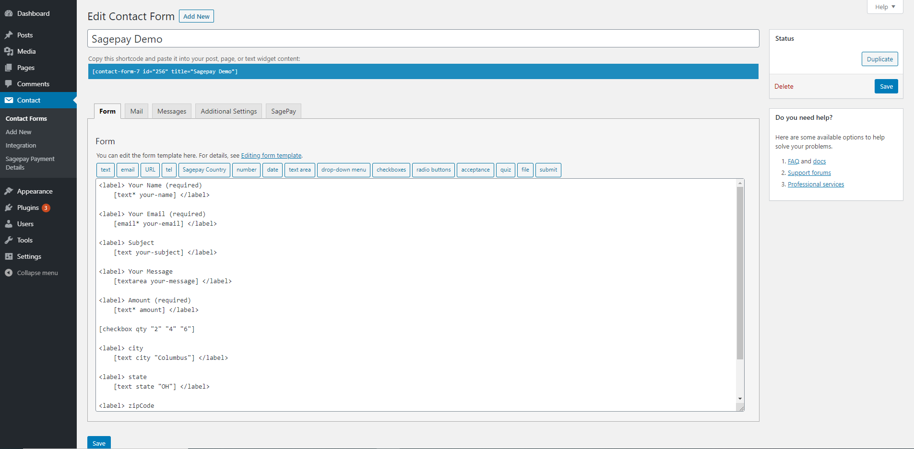
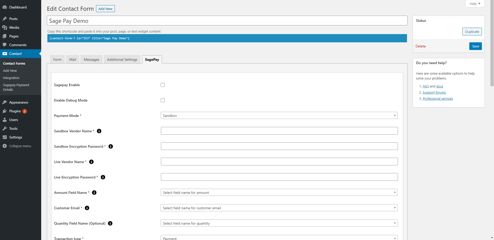
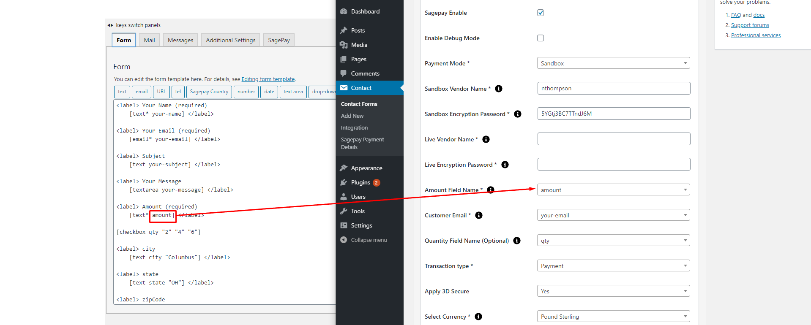
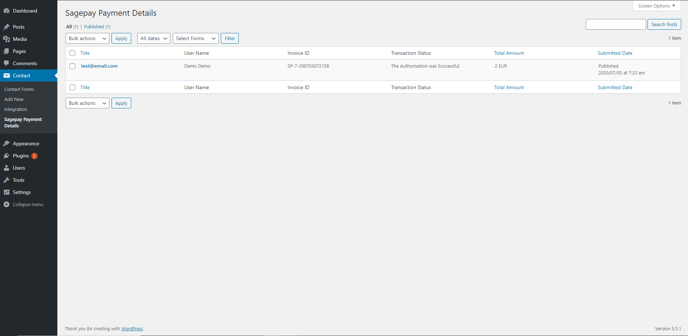

# accept-sagepay-payments-using-contact-form-7
SagePay Server Gateway for accepting payments on your Contact Form 7.

The SagePay Payment system provides a secure, simple means of authorizing credit and debit card transactions from your website.

The SagePay system provides a straightforward payment interface for the customer, and takes complete responsibility for the online transaction, including the collection and encrypted storage of credit and debit card details, eliminating the security implications of holding such sensitive information on your own servers.

The plugin provides you the option to make payment only once. There is no recurring payment option available. Users can select the option to make Payment for one time since recurring transactions are not allowed.

**Features of Accept SagePay Payments Using Contact Form 7**

- Create multiple payment forms using Contact Form 7.
- In the Free version of SagePay, you can view the payment transactions of up to 10 Entries in the admin panel.
- Supports multiple forms on a single post or page.
- Permits to take values from all input fields including drop-down menu, textbox, hidden field, radio buttons, etc.
- Accepts dynamic value from frontend for parameters like item amount, email, quantity & billing, and shipping details.
- Option to Enable SagePay Sandbox Mode to ensure the functioning of the payment transactions.
- You can view SagePay payment data details at the admin side.
- All filters and search facilities are available on the admin side.
- Individual emails are sent to customers and admin after the SagePay payment transaction.
- [sagepay-payment-details] tag added to email content will display SagePay payment response in email.
- There is an option of Shortcode [sagepay-details] to display the transaction ID, transaction amount, and payment status after the transaction is made.
- You can set ‘Success Return URL’ and ‘Cancel Return URL’ pages to redirect after the payment transaction.
- You can use the Country field Tag option to display country in the drop-down; if you are working with the custom approach, you need to set the drop-down value in ISO 3166 ( Examples: GB, IE, and DE ), so we prefer to use our tag to display country list.
- Compatibility of WordPress VIP.

[Learn more about the Pro version](https://store.zealousweb.com/accept-sage-pay-opayo-payments-using-contact-form-7-pro)

**Features of Accept SagePay Payments Using Contact Form 7 Pro**

We have released the PRO version of this plugin with extra advantageous features added. PRO Version 1.0 Released.

- Facility to import, export the list of entire SagePay unlimited Entries.
- In the list of SagePay forms entry in the admin side, you can view payment transactions unlimited Entries.

