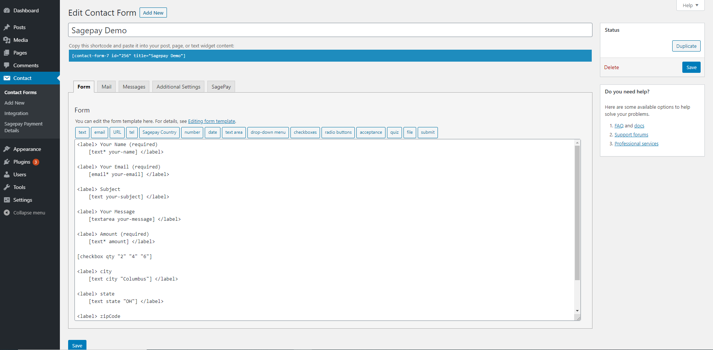
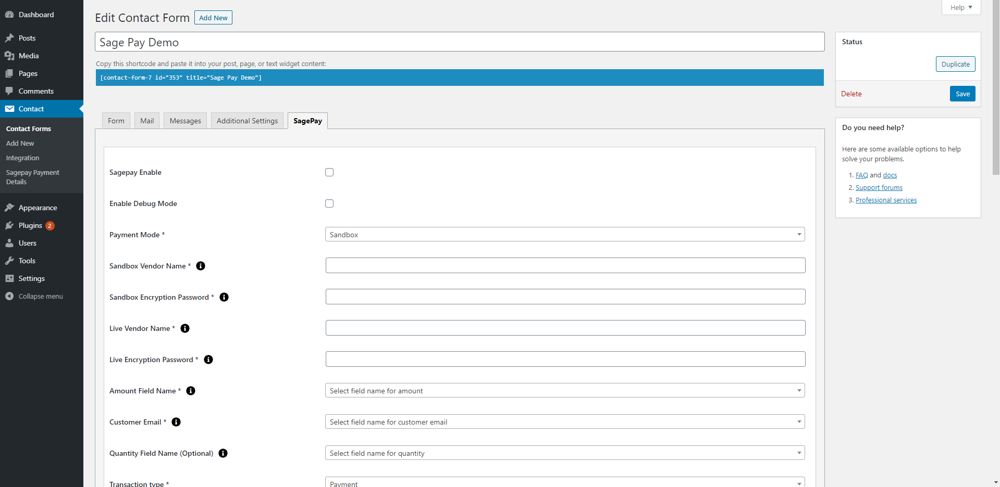
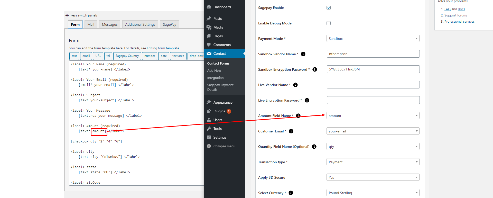
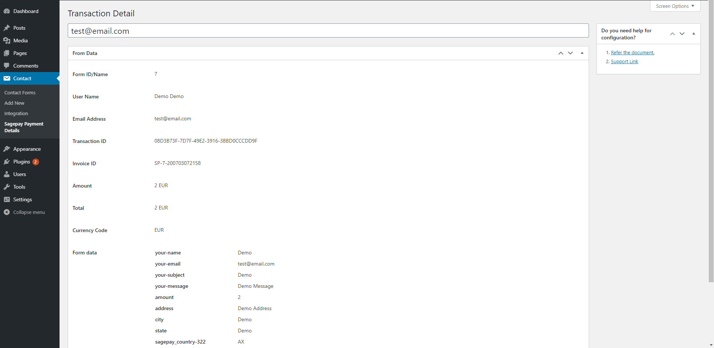
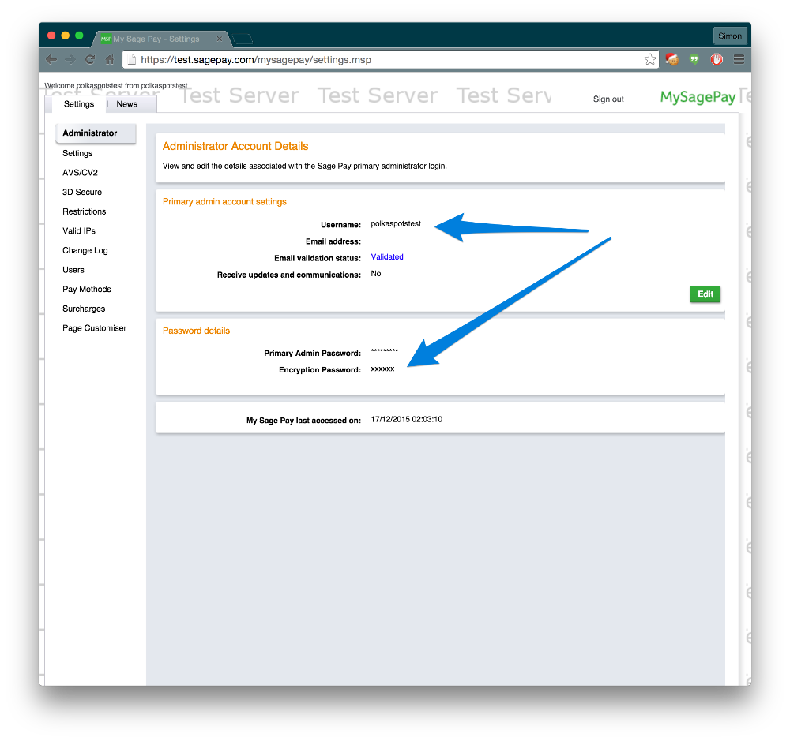

# Accept SagePay Payments Using Contact Form 7
The SagePay Payment system provides a secure, simple means of authorizing credit and debit card transactions from your website.
The SagePay system provides a straightforward payment interface for the customer, and takes complete responsibility for the online transaction, including the collection and encrypted storage of credit and debit card details, eliminating the security implications of holding such sensitive information on your own servers.
The plugin provides you the option to make payment only once. There is no recurring payment option available. Users can select the option to make Payment for one time since recurring transactions are not allowed.

# Installation
1. Download the plugin zip file from WordPress.org plugin site to your desktop / PC
2. If the file is downloaded as a zip archive, extract the plugin folder to your desktop.
3. With your FTP program, upload the plugin folder to the wp-content/plugins folder in your WordPress directory online
4. Go to the Plugin screen and find the newly uploaded Plugin in the list.
5. Click ‘Activate Plugin’ to activate it.

# How To Use

You have to configure it from wp-admin > Contact > Add/Edit Contact Forms (Contact Form 7 needs to be activated before) to use this plugin.
You will find a new tab, “Sagepay,” along with Form, Mail, Messages, Additional Settings from where you can make all settings related to the Sagepay plugin.

SagePay Settings and Configuration

SagePay Amount Field Configuration

SagePay Payment Detail Page

SagePay Transaction Detail Page

Note: You need to add the “Sagepay Country” tag in your form. You will find a tag “Sagepay” along with text, email, URL, etc.

To use the Sagepay option, first, you need to create and save form tags

You can use the Country field Tag option to display the country in the drop-down if u are going with custom u need to set the drop-down value in ISO 3166 ( Examples: GB, IE, and DE ), so we prefer to use our tag to display country list.

To add Sagepay payment form to your Contact Form 7, find the setting attributes given below:

- **Enable Sagepay Payment Form**
Check the Sagepay Payment Form option for Sagepay submit button activation.

- **Enable Debug Mode**
Check the Enable Debug Mode to start transaction debugging.

- **Enable Payment Mode**
This option will allow you to set the Sandbox Sagepay payment process in test mode.

- **Sandbox Vendor Name (required)**
This field is required when you have set Sagepay mode to sandbox if your site is in test mode.
Get Your Sandbox Vendor Name:

- **Sandbox Encryption Password (required)**
This field is required when you have set Sagepay mode to sandbox if your site is in test mode.
Get Your Encryption Password Key:

- **Live Vendor Name (required)**
This field is required to set Sagepay mode to live if your site is in live mode.
Get Your Live Vendor Name:

- **Live Encryption Password (required)**
This field is required when you have set Sagepay mode to live if your site is in live mode.
Get Your Live Encryption Password:

- **Amount Field Name (required)**
You have to select a name attribute for the amount field of Contact Form 7 like dropdown menu, textbox, hidden field, radio buttons, etc.

- **Quantity Field Name (optional)**
You have to select a name attribute for the quantity field of Contact Form 7 like dropdown menu, textbox, hidden field, radio buttons, etc.

- **Customer Email Field Name (required)**
You have to set a name attribute for the text field of contact form 7, from which you need to pass the customer’s custom email to the Sagepay website.

- **Transaction type (required )**
Sage Pay offers you a wide variety of transaction types that you can process. Each of the types differs in the way they process transactions.

- **Apply 3D Secure (required)**
The 3D Secure authentication is an additional fraud prevention scheme that is available to all companies using the Sage Pay system to process transactions.

- **Select Currency (required)**
You can select your currency of Sagepay here. The default is set as GBP(Pound Sterling).

- **VendorTXCode Prefix (optional)**
Please enter the unique prefix name, which displays in the invoice order.

- **Success Return URL (optional)**
You can enter the URL of the page to redirect for a Successful Sagepay Payment transaction.

- **Cancel Return URL (optional)**
You can enter the URL of the page to redirect if a transaction fails.

- **Customer Billing & Shipping Details**
- **1. First Name (required)**
- You have to select a name attribute for the first name field of contact form 7.

- **2. Last Name (required)**
- You have to select a name attribute for the last name field of contact form 7.

- **3. Address (required)**
- You have to select a tag name for the address field of contact form 7.

- **3. City (required)**
- You have to select a tag name for the city name field of contact form 7.

- **4. State (required)**
- You have to select a tag name for the state name field of contact form 7.

- **5. Zip Code (required)**
- You have to select a tag name for the zip code field of contact form 7.

- **6. Country (required)**
- You have to select a tag name for the country field of contact form 7.

# Getting Help

If you have any difficulties while using this Plugin, please feel free to contact us at opensource@zealousweb.com. We also offer custom WordPress extension development and WordPress theme design services to fulfill your e-commerce objectives. Our professional dy‐ namic WordPress experts provide profound and customer-oriented development of your project within short timeframes. Thank you for choosing a Plugin developed by ZealousWeb!

